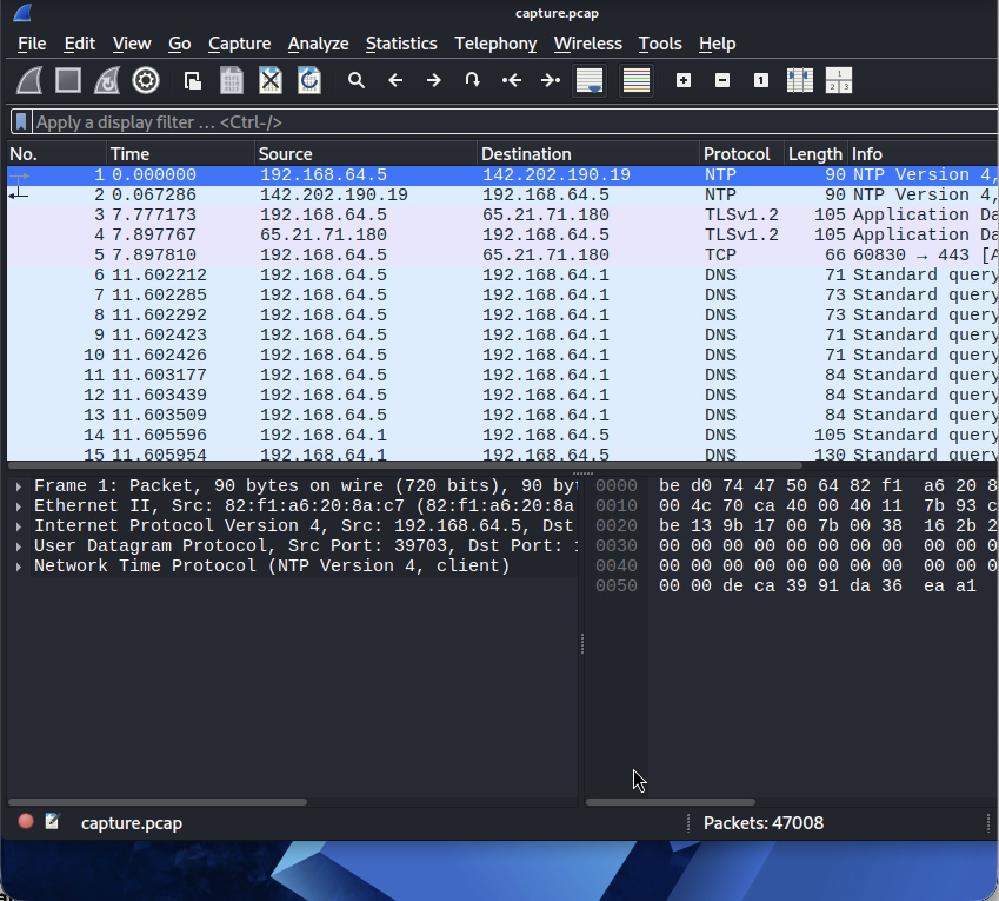
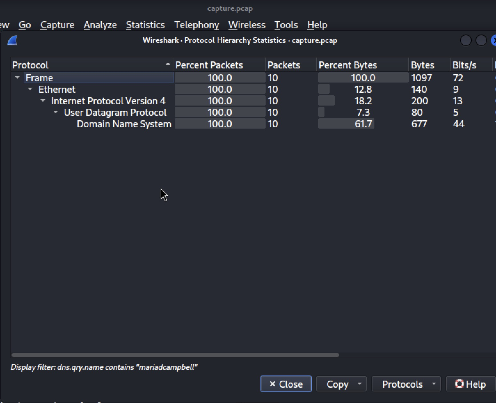
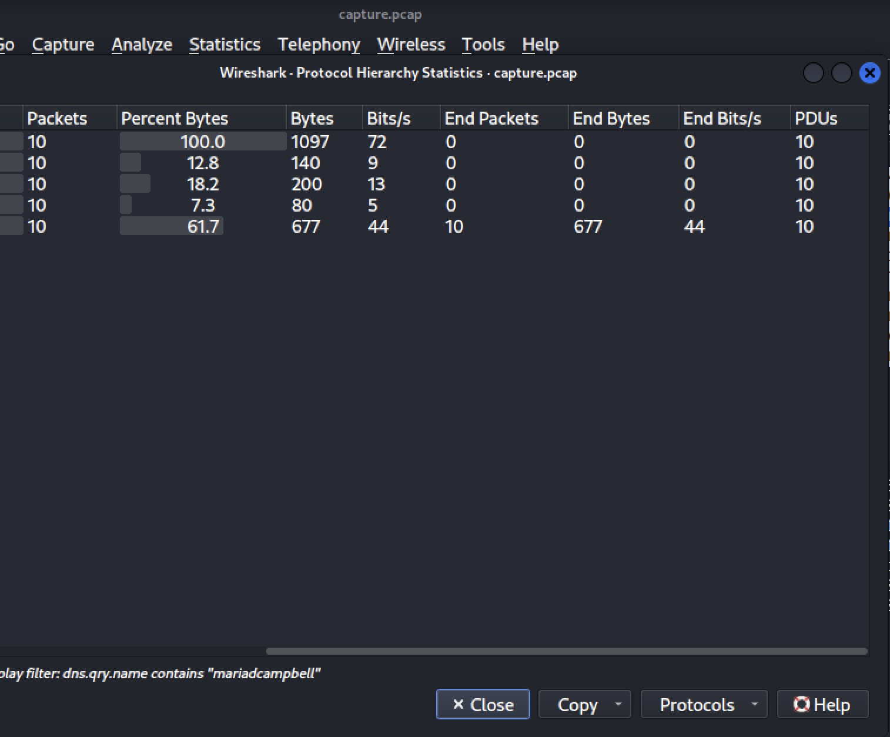
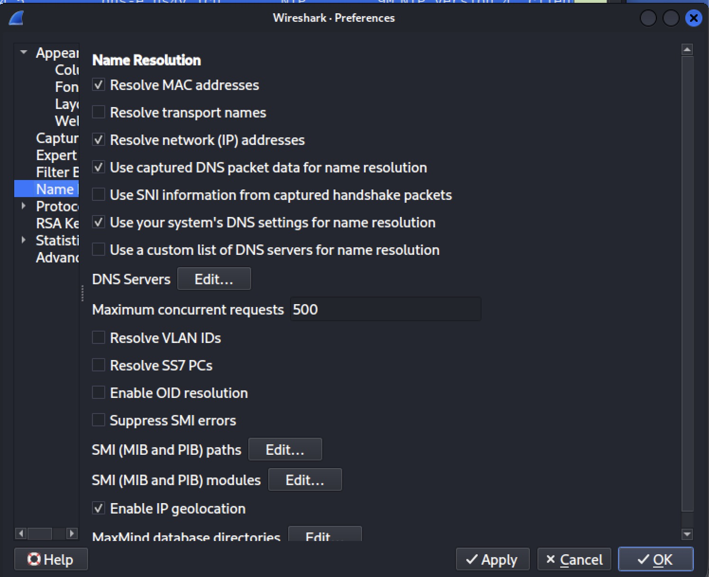
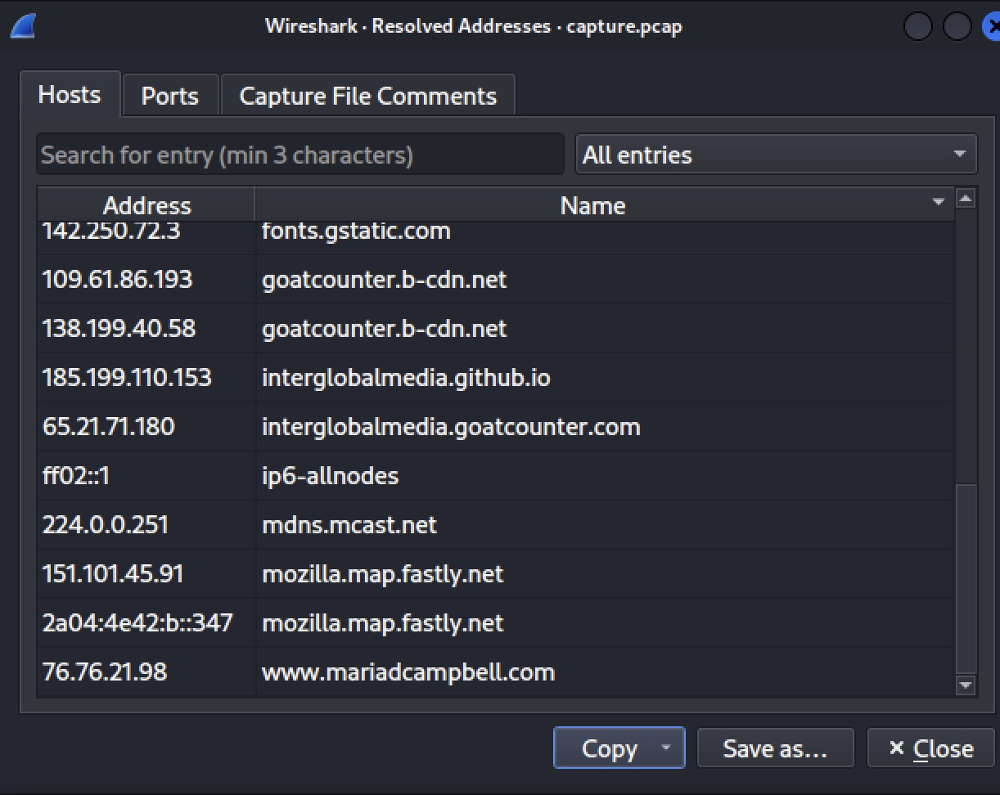
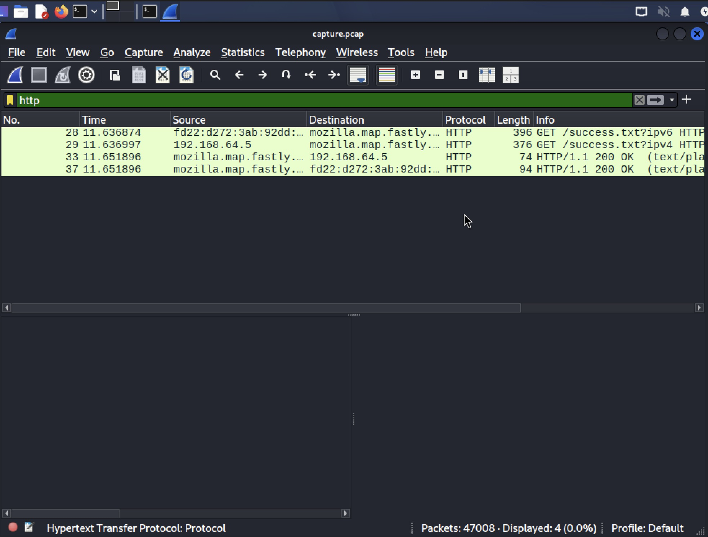
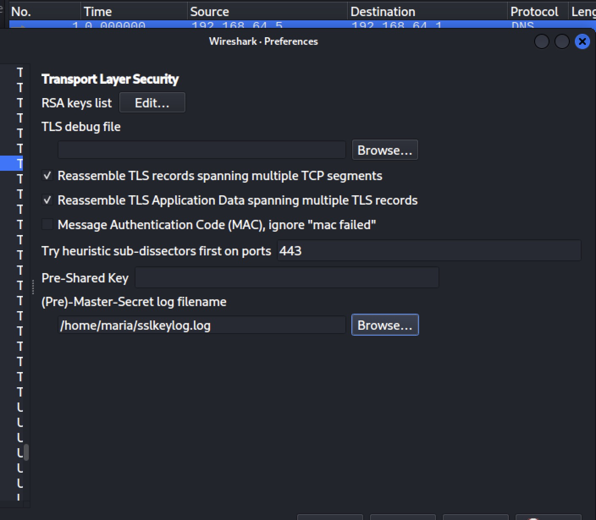
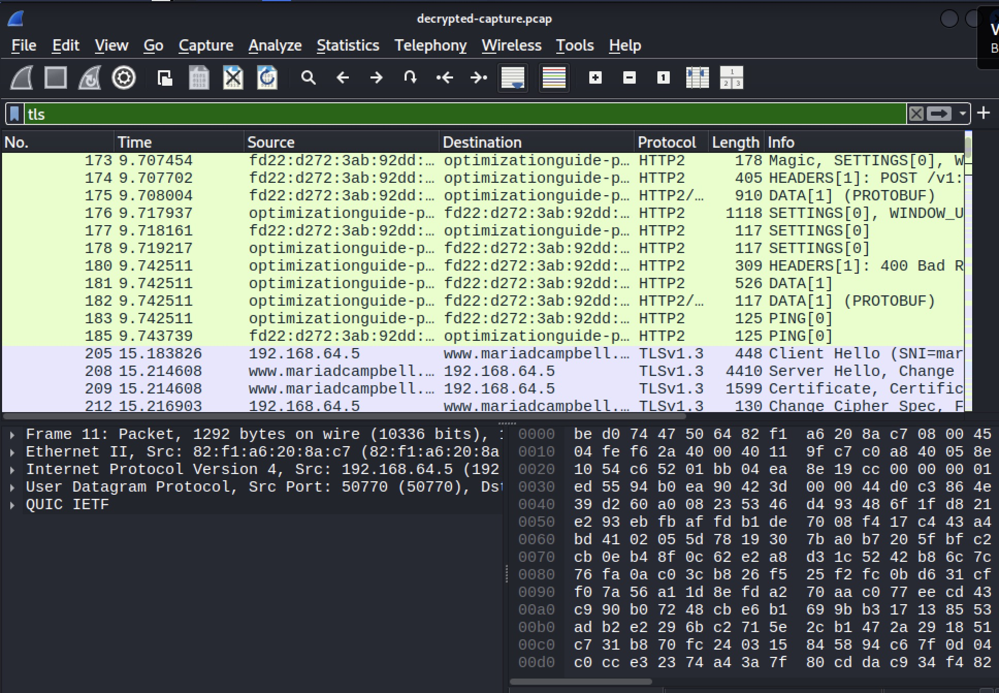
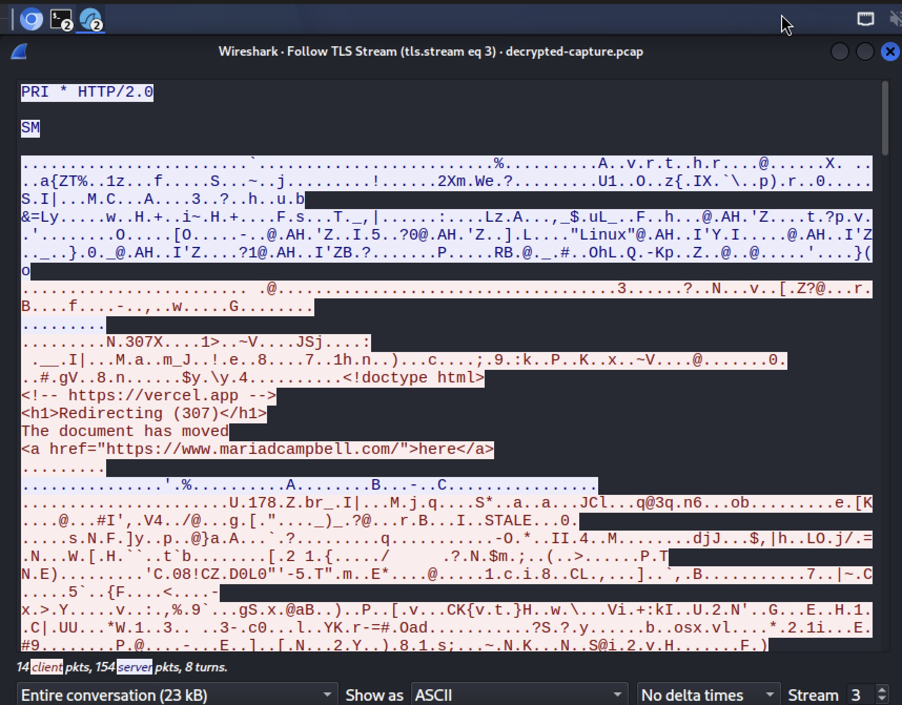

# TLS SNI leak analysis

*This write-up is also available broken into sections in [docs/](docs/), organized by topic if you'd rather navigate than scroll.*

Original idea which I got from Google AI Search (with my initial notes on it included):

## Network Traffic Analysis Project

I can create a network traffic analysis project using Wireshark and tcpdump to capture and analyze network packets. This can enhance my understanding of network protocols, help diagnose connectivity issues, and monitor traffic behavior. Below are the key components and steps to set up my project.

## Project Components

| Tool      |  Purpose |
| --------- | -------- |
| **Wireshark** | Graphical tool for analyzing captured packets.|
| **tcpdump** | A command line utility that allows me to capture and analyze network traffic on my system.|

## Set Up My Environment

1. Install `tcpdump` and `Wireshark` on my system.
1. Ensure I have the necessary permissions to capture network traffic.

## Capture Network Traffic with tcpdump

- Use `tcpdump` to capture packets from a specific network interface[^1].

### Example command

```shell
sudo tcpdump -i <interface> -s 65535 -w capture.pcap
```

This command captures all packets and saves them to a file named `capture.pcap`.

## Analyze Captured Traffic with Wireshark

- Open the `capture.pcap` file in Wireshark.
- Use Wireshark's GUI to filter and analyze the packets.
- Look for specific protocols, such as HTTP or DNS, to understand traffic behavior.
- Decrypt Encrypted Traffic (Optional)
    - If capturing HTTPS traffic, set the SSLKEYLOGFILE[^2] environment variable before launching the browser, so it logs TLS session keys as it negotiates each connection.
    - Point Wireshark at that key log file (Preferences → Protocols → TLS → (Pre)-Master-Secret log filename) to decrypt the matching capture.

## Project Goals

- Understand how different network protocols operate.
- Diagnose connectivity issues by analyzing packet flow.
- Monitor traffic behavior to identify potential security threats.
- This project will provide practical experience with both tools, enhancing my skills in network analysis and cybersecurity.

## Checking for available interfaces

To check for interfaces available to me, I ran:

```shell
sudo tcpdump -D
```

The `-D` flag, short for  `--list-interfaces`, lists the network interfaces available on my system and where `tcpdump` can capture packets.

The command yielded:

```shell
sudo tcpdump -D  

[sudo] password for maria: 

1.eth0 [Up, Running, Connected]
2.any (Pseudo-device that captures on all interfaces) [Up, Running]
3.lo [Up, Running, Loopback]
4.bluetooth-monitor (Bluetooth Linux Monitor) [Wireless]
5.nflog (Linux netfilter log (NFLOG) interface) [none]
6.nfqueue (Linux netfilter queue (NFQUEUE) interface) [none]
7.dbus-system (D-Bus system bus) [none]
8.dbus-session (D-Bus session bus) [none]
```

The logical network interface to select was `eth0`. It is my real interface and the one to capture on.

## Starting the capture

To start a capture, I ran:

```shell
sudo tcpdump -i eth0 -s 65535 -w capture.pcap
```

The command provided me with the following information:

```shell
sudo tcpdump -i eth0 -s 65535 -w capture.pcap

tcpdump: listening on eth0, link-type EN10MB (Ethernet), snapshot length 65535 bytes
```

it told me that I was listening on the eth0 network inferface as I had requested.

The `-i` flag, short for `--interface`, was followed by the name of the network interface I wanted to target (`eth0`).

The `-s` flag, is short for `--snapshot-length`. According to `man tcpdump`, 

> Snarf snaplen are bytes of data from each packet rather than the default of 262144 bytes. Packets truncated because of a limited snapshot are indicated in the output with ``[|proto]'', where proto is the name of the protocol level at which the truncation has occurred.

The number `65535` represents the number of bytes of data returned from the `-s` flag truncation.

The `-w` flag, writes the raw packets to a file instead of parsing and printing them out. They, however, can later be printed with the `-r` option.

`capture.pcap` is the file `tcpdump` writes the raw packets to.

## Generating traffic to capture packets

The `sudo tcpdump -i eth0 -s 65535 -w capture.pcap` command runs silently in the background, so the next thing for me to do was to generate traffic. I visited my Personal Blog (`mariadcampbell.com`) and my project hosted on GitHub Pages called Guess the Keys.

## Stopping the tcpdump packet capture command with Ctrl + C

When I stopped the `sudo tcpdump -i eth0 -s 65535 -w capture.pcap` command, it returned:

```shell
^C
47008 packets captured
47008 packets received by filter
0 packets dropped by kernel
```

I captured 47008 packets in a matter of a few minutes, and 47008 packets were received by filter. And 0 packets were dropped by the Kali Linux kernel. This was a very good thing!

## Opening capture.pcap in Wireshark

Next, I opened the `capture.pcap` file in Wireshark by running:

```shell
wireshark capture.pcap
```

This led me to:



_The wireshark capture.pcap command: it opened the capture.pcap file in the Wireshark GUI_

## Going to Statistics → Protocol Hierarchy

The first thing I wanted to do was go to Statistics → Protocol Hierarchy in Wireshark. Why?

Protocol hierarchy shows me a breakdown of all protocols in a capture, listing each protocol's packet count and byte percentage. This helps quickly identify what types of traffic dominate my network.

### Looking for specific protocols such as HTTP and DNS



_The Protocol Hierarchy in Wireshark_



_The rest of Protocol Hierarchy in Wireshark (overlaps a bit)_

### Finding resolved addresses in capture.pcap

To find resolved addresses in my `capture.pcap` file in Wireshark, first I go into `Edit -> Preferences -> Name Resolution` and then check "Use captured DNS packet data for name resolution".



_Wireshark Preferences with "Use captured DNS packet data for name resolution" checked_

That's the specific option that tells Wireshark to scan the DNS response packets already in my `capture.pcap` and use them to populate the resolved-address table.

### Going to Statistics -> Resolved Addresses

After enabling "Use captured DNS packet data for name resolution" in Wireshark preferences, I had to reload the selected capture. This meant going to `View -> Reload Ctrl key + R key`. I had to reload the selected capture before the DNS-sourced hostnames actually appeared. Checking the box alone didn't retroactively apply to packets already dissected in the open `capture.pcap` file. 

Now when I went into `Statistics -> Resolved Addresses`, I saw those hostnames show up in the Hosts tab alongside the MAC/multicast entries:



_IP Addresses[^3] and their hostnames in Wireshark_

Why did I have to select Wireshark Preferences with "Use captured DNS packet data for name resolution" in `Preferences -> Name Resolution`? If I didn't turn on the "Use captured DNS packet data for name resolution", Wireshark would not utilize any DNS responses that were captured in the file. This means that any hostname resolution that could have been derived from these responses would be unavailable.

Selecting "Use captured DNS packet data for name resolution" option persists across sessions, which means that any capture I started from then on would already have "Use captured DNS packet data for name resolution" from the very first dissection pass. Packet dissection in Wireshark is crucial because it allows the software to decode and analyze the details of network packets, enabling me to understand the data being transmitted. 

### Searching for HTTP protocols in Wireshark

To find only HTTP protocols in my capture.pcap file in Wireshark, I typed http in the Filter Search bar:



_Filtering for HTTP protocols in the capture.pcap file in Wireshark_

## Differences between HTTP and DNS protocols in Wireshark

| HTTP Protocol | DNS Protocol |
| --- | --- |
| Deals with the transmission of web documents between a client and a server, using methods like GET and POST | Resolves domain names to IP addresses |
| HTTP packets show request and response details | DNS packets focus on name resolution queries and responses. |

## Decrypt encrypted traffic

To decrypt the HTTPS traffic in a capture, Wireshark needs the TLS session keys logged at the time the traffic was generated. This means it only works for a capture taken while `SSLKEYLOGFILE` was active. Since my existing capture.pcap was taken without that variable set, it can't be retroactively decrypted. I'd need a fresh capture for this specific demonstration.

First, in a terminal Session, I set the `SSLKEYLOGFILE` environment variable and launch the browser from that same terminal so it inherits it:

```shell
# run one line at a time, and in the below sequence
export SSLKEYLOGFILE=~/sslkeylog.log
# running chromium & ensures that chromium runs in the background so that I can run other commands in the same terminal session/instance
chromium &
# after opening chromium, run tcpdump in a separate terminal instance
sudo tcpdump -i eth0 -s 65535 -w new-decrypted-capture.pcap
# then in same terminal session/window as chromium &, I ran to see if ~/sslkeylog.log appeared in the home directory:
ls -la ~/sslkeylog.log
-rw------- 1 maria maria 25372 Aug 16 00:58 /home/maria/sslkeylog.log
```

The `sslkeylog.log` did actually exist in the home directory.

Chromium recognizes this variable if it's set before the browser is launched. Launching Chromium in a Terminal window other than from the specific one where I exported the `SSLKEYLOGFILE` environment variable wouldn't work since it wouldn't inherit the specific terminal's environment. That's why it was important to run `chromium &`, so that I could run other commands in the same session afterwards.

I had to browse to a site or two as before, and then stop the capture as before.

Then, in Wireshark, I went to `Edit → Preferences → Protocols → TLS`, and in "(Pre)-Master-Secret log filename," I browsed to `~/sslkeylog.log`.

Next I selected `sslkeylog.log`, and then clicked the "Ok" button.



_Selecting ~/sslkeylog.log in Preferences → Protocols → TLS_

Next. I selected a TLS packet from the packet list by typing tls (lowercase) in the filter bar.
 `→ Follow → TLS Stream`, Wireshark automatically decrypted matching TLS sessions in the capture. I saw it reflected as a new "Decrypted TLS" tab in a stream, or plaintext HTTP data instead of raw TLS Application Data records when I followed the stream.



_Filtering TLS streams residing in the sslkeylog.log file_

The TLS stream I selected to decrypt was the one that starts with `205 15.183826`. When I right-clicked it, I selected `Follow → TLS Stream`. When I did that, the following appeared:



_Decrypted https traffic_

To prove decryption actually worked, an Application Data packet (as I selected) is the best choice. It's the one carrying the real page content, so `Follow → TLS Stream` on it would show me the actual `HTTP request/response` (URLs, headers, maybe cookies) instead of the `raw ciphertext bytes` I'd otherwise see.

```html
<!doctype html>
<!-- https://vercel.app -->
<h1>Redirecting (307)</h1>
The document has moved
<a href="https://www.mariadcampbell.com/">here</a>
```

This is a 307 redirect response from Vercel, sending mariadcampbell.com to www.mariadcampbell.com: plaintext HTML that would otherwise have been fully hidden inside the encrypted TLS traffic.

## Filtering for and looking at a TLS Client Hello packet directly to see the Server Name Indication field itself in plaintext

The Application Data packet I decrypted was a TLS Client Hello packet with an SNI field which rendered in plaintext when it was decrypted.

There is a leak in the TLS transmission. It is the Server Name Indication (SNI) field inside the TLS Client Hello message. Even though TLS encrypts the content of a connection, the very first message the client sends happens before any encryption keys exist, so it's transmitted entirely in plaintext. Because many websites share the same server IP address, the client has to tell the server which hostname it wants before the handshake can proceed. That hostname goes into the SNI field. Since this message isn't encrypted, anyone capturing traffic on the network can see exactly which site I'm connecting to, even though everything that follows (the actual page content) is encrypted.

## What is a TLS handshake?

`205, "Client Hello (SNI=mar..."` is a TLS handshake packet.

A TLS handshake is crucial for establishing a secure connection between a client (like a web browser) and a server (like a website). This process ensures that data transmitted over the internet is encrypted and secure from eavesdropping.

## Steps to the TLS Handshake (version 1.3)

The TLS handshake highlighted here is version 1.3 (visible in the Protocol column in the screenshot).

| Step | What is included |
| --- | --- |
| **Key Exchange** | <ul>Establishes shared keying material.</ul><ul>Determines the cryptographic parameters, including:<li>Named groups for shared keys (e.g., ECDHE or DHE).</li><li>Symmetric cipher options for encryption.</li></ul> |
| **Server Parameters** | <ul><li>Sets additional handshake parameters.</li><li>Determines if certificate-based client authentication is required.</li></ul> |
| **Authentication** | <ul>Authenticates the server and optionally the client.</ul><ul>Confirms the integrity of the handshake and the keys exchanged.</ul> |

## Steps in the TLS Handshake (version 1.2)

| Step | What is included |
| --- | --- |
| ClientHello | The client sends a "ClientHello" message to the server. |
| The message includes: | Supported TLS versions, list of cipher suites (encryption methods), a random byte string known as "client_random" |
| ServerHello | The server responds with a "ServerHello" message. |
| This message contains: | The chosen TLS version, the selected cipher suite, its own random byte string known as "server_random" |
|  Server Authentication | The server sends its digital certificate to the client. |
|| The client verifies the server's identity using this certificate. |
| Key Exchange | The client generates a session key using the server's public key and sends it to the server. |
|| This key is used for symmetric encryption during the session. |
| Finished Messages | The client sends a "Finished" message encrypted with the session key. |
|| The server responds with its own "Finished" message, also encrypted. |

My `ClientHello` step maps to packet `205 (15.183826)`, the one showing `Client Hello (SNI=mariadcampbell.com...)`. This is the packet that demonstrates a leak. The SNI field is in plaintext before any encryption is established.

My `ServerHello` step maps to `packet 208 (15.214608)`: `ServerHello`, `Change Cipher Spec`.

My `Server Authentication` step maps to `packet 209 (15.214608)`: Certificate, Certificate Verify, the server presents its cert chain.

Since my capture is TLS 1.3 (visible in the Protocol column), it streamlines the classic handshake (version 1.2) flow my table describes. Key exchange isn't a separate step sent after `ServerHello`. It happens via key material embedded directly in the `ClientHello` and` ServerHello` themselves (a "key_share" extension), and the `certificate exchange` (packet 209) is actually encrypted in TLS 1.3, unlike TLS 1.2 where it travels unencrypted.

## TLS handshake 1.2 vs 1.3

| Feature | TLS 1.2 | TLS 1.3 |
| --- | --- | --- |
| **Round Trips Required** | 2 | 1 |
| **Cipher Suites** | Supports weak algorithms | Only strong cipher suites |
| **Forward secrecy**[^4] | Not mandatory | Mandatory |
| **Renegotiation**[^5] | Present | Removed |

The improvements in TLS 1.3 make it a preferred choice for secure communications, enhancing both performance and security for users.

## The purpose of the TLS handshake

The primary goals of the TLS handshake are:

- Authenticate the server (and optionally the client)
- Agree on encryption standards
- Establish a secure channel for data transmission

Once the handshake is complete, both parties can communicate securely using the established session keys. This process is crucial for protecting sensitive information, such as passwords and credit card details, during online transactions.


## Related Resources

- [8.3. Resolved Addresses](https://www.wireshark.org/docs/wsug_html_chunked/ChStatResolvedAddresses.html): _wireshark.org_
- [The Transport Layer Security (TLS) Protocol Version 1.3](https://datatracker.ietf.org/doc/html/rfc8446): _Internet Engineering Task Force (IETF)_
- [A Detailed Look at RFC 8446 (a.k.a. TLS 1.3)](https://blog.cloudflare.com/rfc-8446-aka-tls-1-3/): _blog.cloudflare.com_

## Footnotes

[^1]: A network interface is where a computer and network connect on Linux.

[^2]: `SSLKEYLOGFILE` is used to specify a file where TLS secrets are logged, allowing tools like Wireshark to decrypt HTTPS traffic. It must be set before starting applications like browsers or curl to capture the necessary key log data.

[^3]: An IP address is a numerical address, such as 192.168.1.1, assigned to a device on an IP network, so other devices can identify it. It has two main functions: identifying a device’s network interface and helping route traffic to its location on the network.

[^4]: Forward secrecy in TLS ensures that session keys are unique and not compromised even if long-term keys are exposed. This means that past communications remain secure even if a server's private key is later compromised.

[^5]: TLS renegotiation is a process that allows a client and server to establish new cryptographic parameters for an existing TLS connection. However, it has vulnerabilities that can be exploited, such as allowing an attacker to inject malicious content into the connection if not properly secured.